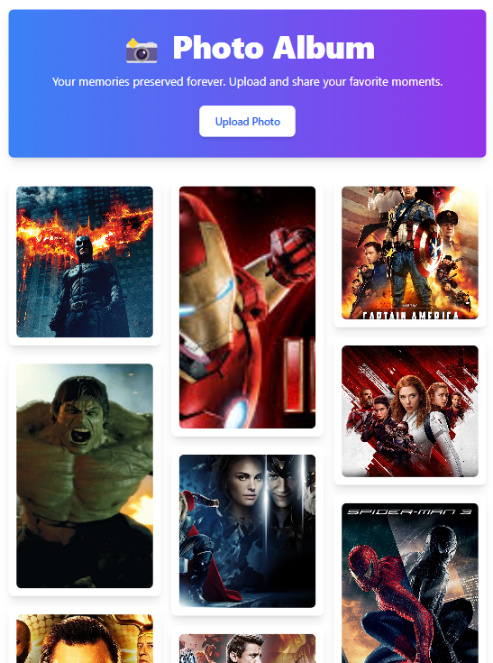

# Photo Gallery

**Photo Gallery** is a React-based project that implements a photo gallery where users can browse images. Clicking on an image opens a modal displaying the image in full size. The modal includes options to open the image, close it, or navigate back.

  
  
  
  

## Features

- View images in a responsive grid.
- Open images in a full-screen modal.
- Close the modal or click Back to exit the modal.

## Technologies Used

- React.js
- Node.js
- mongoDB
- tailwind CSS
